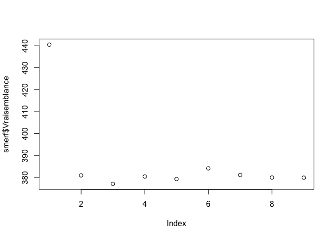

<!-- README.md is generated from README.Rmd. Please edit that file -->

# LongituRF

<!-- badges: start -->

[](https://pnavaro.github.io/LongituRF/)

<!-- badges: end -->

The goal of LongituRF implements Random forests for longitudinal data
using stochastic semiparametric miced-model

## Installation

You can install the development version of LongituRF from
[GitHub](https://github.com/) with:

``` r
# install.packages("devtools")
devtools::install_github("sistm/LongituRF")
```

## Example

Simulate longitudinal data according to the semi-parametric stochastic
mixed-effects model

``` r
library(LongituRF)
set.seed(123)
data <- DataLongGenerator(n=20) # Generate the data composed by n=20 individuals.
```

Train a SMERF model on the generated data. Should take ~ 50 seconds The
data are generated with a Brownian motion, so we use the parameter
sto=“BM” to specify a Brownian motion as stochastic process

``` r
smerf <- MERF(X=data$X,Y=data$Y,Z=data$Z,id=data$id,time=data$time,mtry=2,ntree=500,sto="BM")
#> [1] "stopped after 8 iterations."
```

is the fitted random forest (obtained at the last iteration).

``` r
smerf$forest 
#> 
#> Call:
#>  randomForest(x = X, y = ystar, ntree = ntree, mtry = mtry, importance = TRUE) 
#>                Type of random forest: regression
#>                      Number of trees: 500
#> No. of variables tried at each split: 2
#> 
#>           Mean of squared residuals: 0.3791148
#>                     % Var explained: 97.73
```

are the predicted random effects for each individual.

``` r
smerf$random_effects 
#>              [,1]       [,2]
#>  [1,] -0.47044130 -1.9996332
#>  [2,] -0.61467293 -2.0327449
#>  [3,]  0.61464395  2.6097592
#>  [4,] -0.67621146 -1.9164338
#>  [5,]  0.47927855  1.5402910
#>  [6,] -0.51480557 -1.3320281
#>  [7,] -0.80152943 -1.6187361
#>  [8,] -0.12082083 -0.6422576
#>  [9,]  0.48665502  1.2012401
#> [10,]  0.67057162  2.7274994
#> [11,] -0.70194681 -1.3422333
#> [12,] -0.05961006  0.9314583
#> [13,] -0.06302667  0.6108518
#> [14,]  0.07380411  0.4119336
#> [15,] -0.14161043 -0.6571476
#> [16,]  0.32845088  1.2642185
#> [17,]  0.27370622  0.8166049
#> [18,]  0.21915431  1.8131999
#> [19,]  0.50600274  1.2632782
#> [20,]  0.28071744  0.8784794
```

are the predicted stochastic processes.

``` r
smerf$omega 
#>   [1]  0.042927895  0.147544244  0.728306436  0.238740648  0.878555073
#>   [6]  1.372391811  1.355081942  1.714186164  2.454631871 -0.224172727
#>  [11] -0.771619578 -0.638139662 -0.110855877 -0.274885812  0.154821025
#>  [16]  0.223535598  0.960308660  1.564343196  1.793740627  2.739708485
#>  [21] -0.054726450  0.430217111  0.997516942  1.831464899  1.951099579
#>  [26]  2.031300484  1.087187372  0.806847836  0.688782384 -0.401169616
#>  [31] -0.956470995 -0.665016679 -0.945473912  0.010352006 -0.750865218
#>  [36] -1.424897583 -1.752543069 -2.239487437 -2.648899202 -3.027363201
#>  [41]  0.196395325  0.228399016  0.543749080  0.727684010  0.602878173
#>  [46] -0.170359202 -0.536112711 -0.102531844  0.247532652  0.767423467
#>  [51]  1.325316992 -0.366771859 -1.020826847 -1.864767301 -2.427532790
#>  [56] -2.564137250 -1.983315824 -1.992792953 -1.984368974 -0.791009731
#>  [61] -1.060418450 -1.742087391 -1.999776297 -2.077471760 -2.343449131
#>  [66] -1.929655325 -2.610273737 -2.796641310 -2.701594138  0.073220663
#>  [71] -0.231037958  0.046660523  0.099412681  0.311706388 -0.396716624
#>  [76] -1.138871184 -1.440298127 -1.431893457 -1.852242873 -1.936148046
#>  [81]  0.374720508  0.966894339  0.180994587  0.213632067  0.225978579
#>  [86]  0.975305431  0.953457605  0.127776817 -1.024882008 -1.534164706
#>  [91] -0.001848051  1.161949828  2.320147583  3.293365800  3.786215700
#>  [96]  4.926242594  5.359637740  5.492835310  5.636595192 -0.729166229
#> [101] -1.989150100 -2.572208174 -2.659577307 -1.795959803 -0.927460392
#> [106] -0.504197017 -0.148582145  1.012720220  1.488879857  1.834392941
#> [111] -0.567131762 -0.573726849 -0.564203770  0.038629294  1.074468772
#> [116]  0.748523124  0.733761874  0.037340906 -0.213708488 -0.418904793
#> [121] -0.580671267 -1.068210288 -1.126850876 -1.697832750 -1.627826269
#> [126] -0.735778166 -0.742535863 -0.365548489 -0.028418638 -0.054202228
#> [131]  0.168411153  0.572619731  0.670570822  0.655614988  0.571203358
#> [136]  0.273826235 -0.138430043 -0.084212296  0.898791686  0.039609805
#> [141] -0.526291887 -0.696857399 -0.364099349 -0.403731834 -1.022063465
#> [146] -1.677498811 -2.100962879  0.033758667 -0.244497454 -0.550166836
#> [151] -1.578982421 -1.852133463 -0.999842061  0.247771832 -1.370710819
#> [156] -1.836427260 -2.353524574 -2.387391163  0.142613696  0.727265431
#> [161]  1.528823903  2.592088502  2.612094030  2.607972015  2.564047997
#> [166]  2.476983080 -0.446067115  0.087469549  0.864508802  1.638133768
#> [171]  1.694184422  1.942668233  2.343957499  2.397603230  0.382716827
#> [176]  1.150850959  1.842091667  1.874638531  1.119218402  0.690999538
#> [181]  0.239809886 -1.590678616 -2.553255395  0.126474662 -0.343000674
#> [186]  0.495459710 -0.205166657 -1.642776091 -1.375574273 -0.751664243
#> [191] -0.174300782 -0.442753968 -0.493623295 -0.266079680
```

``` r
plot(smerf$Vraisemblance) # evolution of the log-likelihood.
```



OOB error at each iteration.

``` r
smerf$OOB 
#> [1] 12.4233086  0.6753460  0.4546375  0.3986009  0.3865408  0.3887012  0.3772537
#> [8]  0.3791148
```
